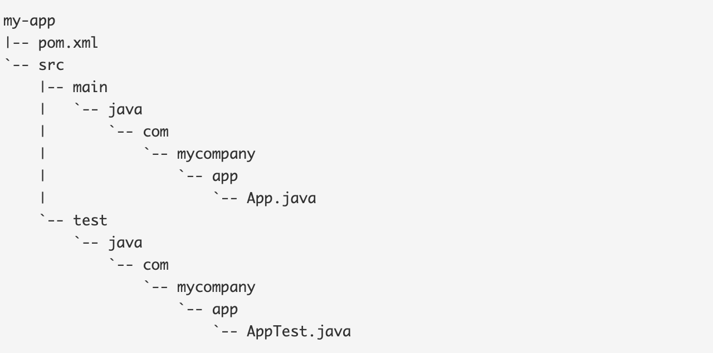
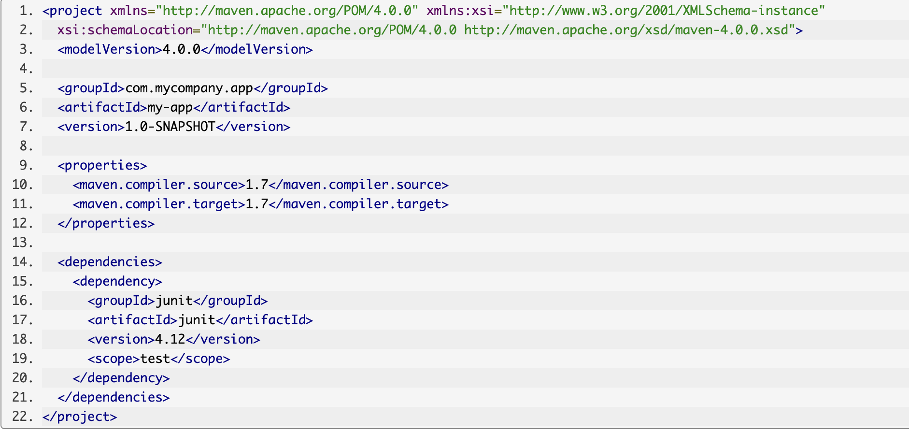

# Creating a Project

Let's create a brand new Maven project. From the Welcome Screen select New Project, or if you already have an IntelliJ IDEA project open, select File -> New -> Project...

Select Maven from the options on the left, and choose the JDK for the project.

We can optionally choose a maven archetype to use to create the project. If you're creating a simple project, you don't need to select an archetype.

Press Next.

You need to give the project a name, and you can optionally set the location. If you click on Artifact Coordinates you'll see more Maven settings.

You can declare a group id, and the artifact id of the application itself.

Press Finish, and IntelliJ IDEA will generate the Maven pom.xml for you.

As well as creating the basic pom.xml, IntelliJ IDEA has also created the default directory structure for a Maven project with the source and test folders defined.

You can use ⌘E (macOS) / Ctrl+E (Windows/Linux) and then type i⌘E (macOS) / Ctrl+E (Windows/Linux)n Maven to open the Maven Projects window, where you can see the standard Maven lifecycle phases, as well as the goals defined by various Maven plugins.

Standart structure of maven project: [Strucutre of maven project ](https://maven.apache.org/guides/introduction/introduction-to-the-standard-directory-layout.html)

# The POM 

The pom.xml file is the core of a project's configuration in Maven. It is a single configuration file that contains the majority of information required to build a project in just the way you want. The POM is huge and can be daunting in its complexity, but it is not necessary to understand all of the intricacies just yet to use it effectively. This project's POM is:

# Running Maven Tools: Maven Phases

Although hardly a comprehensive list, these are the most common default lifecycle phases executed.

**validate**: validate the project is correct and all necessary information is available

**compile**: compile the source code of the project

**test**: test the compiled source code using a suitable unit testing framework. These tests should not require the code be packaged or deployed

**package**: take the compiled code and package it in its distributable format, such as a JAR.

**integration**-test: process and deploy the package if necessary into an environment where integration tests can be run

**verify**: run any checks to verify the package is valid and meets quality criteria

**install**: install the package into the local repository, for use as a dependency in other projects locally

**deploy**: done in an integration or release environment, copies the final package to the remote repository for sharing with other developers and projects.

There are two other Maven lifecycles of note beyond the default list above. They are

**clean**: cleans up artifacts created by prior builds

**site**: generates site documentation for this project

Phases are actually mapped to underlying goals. The specific goals executed per phase is dependant upon the packaging type of the project. For example, package executes jar:jar if the project type is a JAR, and war:war if the project type is - you guessed it - a WAR.

# helpful links with more information

[Maven lifecycle ](https://maven.apache.org/guides/introduction/introduction-to-the-lifecycle.html)

[Maven plugins ](https://maven.apache.org/guides/mini/guide-configuring-plugins.html)

[Maven archotypes ](https://maven.apache.org/guides/introduction/introduction-to-archetypes.html)

[Maven repositories ](https://maven.apache.org/guides/introduction/introduction-to-repositories.html)

[Maven tutorials ](https://cguntur.me/2020/05/20/understanding-apache-maven-the-series/)

[Maven JetBrains info ](https://www.jetbrains.com/help/idea/maven-support.html)
